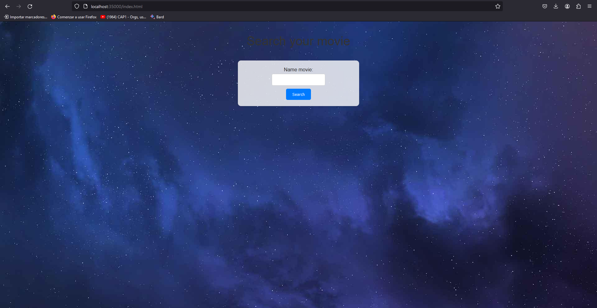
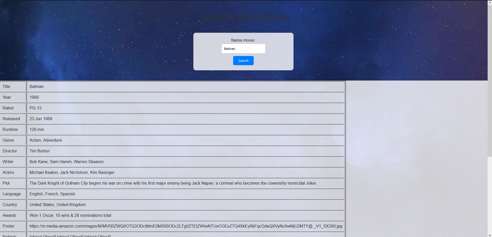
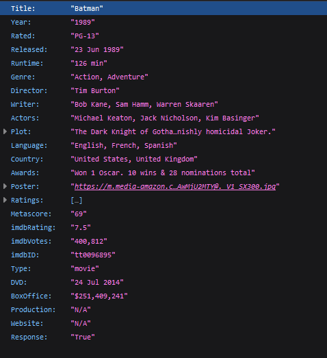

# Microframeworks WEB (Taller 3)

## RETO 

Para este ejercicio usted deb construir un  servidor web para soportar una funcionalidad similar a la de Spark. Su aplicación debe permitir por lo menos el registro de servicios get y post usando funciones lambda. Implemente igualmente funciones que le permitan configurar el directorio de los archivos estáticos, y otra que permita cambiar el tipo de la respuesta a "application/json". Para esto solo debe usar el API básico de Java. No utilice frameworks como Spark o Spring.

## Diseño

1. Interfaz Function:
- Una interfaz funcional llamada Function define un método handle que toma una cadena de solicitud URI y devuelve un arreglo de bytes. Esta interfaz se utiliza para representar funciones que manejan solicitudes HTTP.

2. Clase HttpServer:
- La clase HttpServer implementa el servidor HTTP y contiene métodos para manejar solicitudes GET y POST.
- Utiliza un enfoque de diseño singleton, con una única instancia accesible a través del método estático getInstance().
- Contiene mapas estáticos (actionsGetMap y actionsPostMap) que almacenan funciones asociadas a rutas para los métodos GET y POST respectivamente.
- El método main inicia el servidor, acepta conexiones entrantes y maneja las solicitudes HTTP.
- Define métodos privados para generar encabezados y cuerpos de respuestas HTTP exitosas y de error.
- Permite registrar funciones para manejar solicitudes GET y POST mediante los métodos get y post.
- Contiene métodos para buscar funciones registradas según la ruta y el método de la solicitud.

3. Clase MisServicios:
- Una clase de ejemplo (MisServicios) que utiliza el servidor para registrar funciones específicas para las rutas "/movie" (GET) y "/name" (POST).
- Utiliza la clase MovieAPI para realizar una solicitud a una API externa en el caso de la ruta "/movie".

4. Clase MovieAPI:
- Una clase que encapsula la lógica para realizar solicitudes a una API externa (en este caso, la API de OMDB para obtener información sobre películas).
- Contiene un método getMovie que toma un nombre de película como parámetro, realiza una solicitud HTTP a la API de OMDB y devuelve la respuesta en formato JSON.

## Instrucciones de uso 

- Para hacer uso del programa son necesarias tener instalado lo siguiente:
    - Java (JKD)
    - maven 

1. Abra su consola de comandos y clone el repositorio 
```
$ git clone https://github.com/MiguelBarreraD/Microframeworks-WEB.git
```
2. Ingrese a la carpeta del repositorio:
```
$ cd .\Microframeworks-WEB\
```
3. Compile el poyecto:
```
$ mvn clean package
```
4. Una vez compilado el proyecto, ejecute el siguiente comando para iniciar el programa (asegúrese de estar dentro de la carpeta principal):
```
$ java -cp .\target\classes\ org.example.MisServicios
```
5. Finalmente, acceda a la siguiente URL en su navegador para utilizar la aplicación:
```
→ http://localhost:35000/index.html
```
6. Dentro de la aplicación, encontrará la interfaz principal.
-   Ingrese el nombre de la película que desea consultar y seleccione el botón 'Search'.


7. A continuación podra ver toda la información de la pelicula consultada.



## Uso de petición GET

Una vez el programa este corriendo si desea usar la respuesta de la pelicula directamente siga los siguientes pasos:

```
http://localhost:35000/action/movie?name=(Nombre de la pelicula)
```
Por ejemplo:

```
http://localhost:35000/action/movie?name=Batman
```
La respuesta tendar que verse tal que así:



## Pruebas unitarias
Para realizar pruebas unitarias ejecute el siguiente comando:
```
$ mvn test
```

### Autor
 - Miguel Angel Barrera Diaz